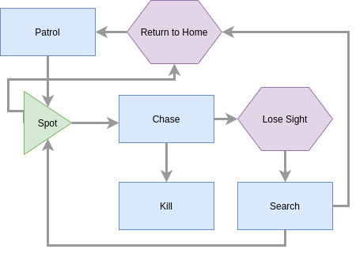
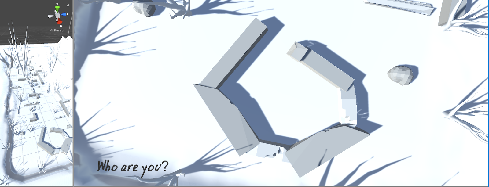

Blue was a game me and a friend made for NCEA Level 2 programming. The game was a short stealth game where you played as a ball of light running away from dementor like creatures. It was our first unity project and as such lacks a lot of polish and is a little buggy. I think the mood and the ambiance are the aspects that turned out best in the game. We ended up running out of time so the AI is a little wack and some things are un-textured.

<video src="demo.mp4" controls></video>

 

*The "dementor's" artificial intelligence was quite crude. It simply switched 
between modes if conditions were met.*

*The environment was a big part of the game and we used it to create the desired
ambiance.*