<style>
figcaption {
    text-align: center;
    padding: 5px;
    font-size: 10px;
    color: grey;
    font-style: oblique;
}
img {
    cursor: pointer;
}
</style>

> Please keep it in mind that this document was aimed at NCEA technology markers.
> As such, it uses alot of design terminology and is a bit shy when it comes to 
> technical jargon. It's also excessively long.

> **TL;DR I make a website to let people make events and order tickets to those events**

<div class="videoCard">
<video src="vid/demo.mp4" controls autoplay></video>
</div>


<hr/>
1. [Introduction] (#Introduction)
2. [Problem Definition] (#Problem Definition)
3. [Brief] (#Brief)
4. [Design and Planning] (#Design and Planning)
5. [Developing An Outcome] (#Developing An Outcome)
6. [Testing] (#Testing) 
7. [Conclusion] (#Conclusion)  


## Introduction {#Introduction}

> “All the world’s a stage, And all the men and women merely players; They have their exits and their entrances, And one man in his time plays many parts.” ~William Shakespeare

The word theatre comes from the Greek “theasthai”, meaning behold. The theatre has been around for over 2,500 years since it’s origins in ancient Greece. It is one of the crowning artistic achievements of mankind and led to the creation of television and movies. In 2018 those movies sold 1,313,239,554 tickets. There is an unsung hero to theatre, movies, and other events, that hero is the humble **ticket**.

In this project, I created a website to address the needs of the drama department at my school and other event organisers in the community. The website is *flexible* enough for event organisers to create tickets to a broad range of events. Event-goers can then browse and purchase tickets online.

## Problem Definition {#Problem Definition}

### Inception

Hillcrest High School hosts several events annually. Those events are highly diverse in character and range from the School Ball to Shakespeare shows. Their tickets are sold manually by office staff and volunteer students. This year, the Year 13's performed Shakespeare’s "The Tempest". The office staff unwittingly oversold tickets, consequently, extra seats had to be set up to cram people into the school's modest performance hall. Ms Binks, the head of the drama department, found the mistake to be difficult and frustrating. Ms Binks began studying ways to avoid a repeat. Luckily I was looking for a real problem to solve through programming. When we met she described her need for a ticketing solution.

### Issue

Ms Binks emphasised that the school puts on cheap events that normally cost between one and ten dollars. This figure is solely to cover costs, rather than to make a profit. Since the tickets are cheap it means that the ticketing solution needs to be inexpensive. Unfortunately, costly fees are prevalent in the ticket sale business, effecting the organisers of small scale community events. This type of person could benefit from an easy way to advertise and sell their tickets. Regrettably, all of the revenue can not go to event organisers, because online transactions have fees and hosting will also take money. The major issue for Ms Binks was price and keeping fees to a bare minimum.

During a discussion with her, she explained that the outcome needed to allow non-programmer to add and manage events. I discussed how I envisioned event organisers filling out a questionnaire that is then used to generate an event page. Ms Binks describe how they need to be able to see how many tickets had been sold. She conveyed how the outcome would need a way to facilitate door sales by event staff rather than solely online sales. Overall Ms Binks was thrilled with the possibilities.

The inciting incident for the project was the inaccurate sale of tickets. Ms Binks was eager to not have the same issue happen again, so she stressed that the ticketing solution would need to avoid overselling tickets like the accounts office did. This highlighted to me the importance of the ticketing solution to be reliable. It would be a total failure if the outcome oversold or undersold tickets especially since the tickets cost money. The reputation of the drama department would be at stake and I should do everything to avoid the same embarrassing mistakes.

The final aspect we discussed was that the event have different prices for students and adults. The outcome would need to allow for multiple ticket types. To me, this highlighted that the solution would have to be flexible to account for a range of use cases. Not just the most obvious ones. An idea that would be reinforced when I talked to other stakeholders.

#### Issues With Current Solutions

Ticketing websites are not an original idea. After all, most people have used one. The originality of my outcome is not through the novelty of the concept itself. During my conversations with Ms Binks we discussed the ticketing services that Ms Binks had already looked at, the major issue that she had using these websites is that most of them are not designed to work with smaller scale events or were too costly. My outcome is original through its specialisation for non-profit and small-scale events, as well as its *flexibility*.

#### Pricing

Small and inexpensive events like our drama productions are unprofitable for large ticketing companies. Most websites (like Ticketek or iTicket) don't permit the creation of small events. Some ticketing websites would allow the creation of events but would take a substantial cut of the profit. Eventbrite is one case. It lets anyone create an event without a minimum price or size. Eventbrite has a charge that is too sizeable to make it useful to her. Most of the events Ms Binks put on are $3 per ticket. On Eventbrite the charge for a ​$3 ticket would be $0.78. We considered how it would be good if the service would allow a larger portion of the revenue to go to the actual performance rather than the ticketing service. It shows how most websites do not support the scale that mine would.

> *"We would want this to be more affordable than what is available on the market as we are non-profit organization"* - Ms Binks


#### Ethical Tickets

While doing some background research into other ticketing solutions I came across some controversy where ticketing companies have been accused of abusing their position in the market. In 2012 Ticketek and Ticketmaster were awarded the Shonky Award by Choice, a non-profit that campaigns on behalf of consumers (like Fair Go), for their excessive fees. The practice is called **drip pricing**, where fees are added during the purchasing process. Consumers are slowly forced to accept more and more expenses.

I went through the process of ordering tickets for the *Queen + Adam Lambert Rhapsody Tour* [^1] on ticket master. I made a break down of the tickets final price.

1. Original $234.48 (Expected)
2. *Order processing fee: $5.00*
3. *Levy NZ: $2.00*
4. *Payment processing fee: $5.39*
5. *Ticket Insurance: $2.00*

The user does not learn of all of these costs at once and is instead *drip priced*. Initially the user learns that the tickets range from $107 → $703. Once a ticket is committed to, the user then learns of the payment processing fees and levy which are added to the ticket price. Only when the user is on the purchasing screen, is the order processing fee added. When I was first going through this process I confused the payment processing fee with the order processing fee, which are in fact two separate charges. Not only is this a *Shonky Practice* its just plain annoying and upsetting.

The technique exploits a logical fallacy called **The Sunk Cost Fallacy**. It is where we are more likely to spend resources on something we are already invested in. When you first select the ticket you are expecting to pay $107. But when you have to select a ticket you discover the $107 tickets do not have a view of the stage. At this point you are willing to pay $107 and have already paid the cost mentally, so you easily get upgraded to the $234.48 ticket only an increase of $127. As you continue the additional costs seem insignificant until you end up paying more than expected. This is the mechanism of the sunk cost fallacy.

While making the purchase a timer appears, which rushes the process and stressing the user. The timer exists for technical reasons so the website can avoid a race condition where multiple people are trying to purchase the same ticket. Hiding and having a very generous or no time would not rush the user and could still achieve the same technical purpose.

#### Broader Issues

##### Events Captain

Viola, Hillcrest High School's events captain, is responsible for the organisation of the two main social events of the year: The Cabaret and The Ball. The Cabaret is a casual social event for most students at the school, while the ball is the premier event that is restricted to senior students. These events are again manually ticketed by the school office in advance. In previous years the Cabaret has sometimes struggled to sell enough tickets. Possibly due to the inelegant process of purchasing tickets. Both events also pose an intriguing issue because the school restricts attendance based off of school attendance. A student whose school attendance falls below a certain threshold is restricted from purchasing tickets to either event. With this in mind, I sent an email to Viola with some questions about what sort of challenges she faces concerning ticketing. We met and discussed the issue in the library.

Viola talked about the importance of being able to advertise an event and how she would like tools to be able to manage and track the sale of tickets. This was primarily motivated by the struggle of the cabaret in previous years to sell tickets. If the cabaret lacked sales the event was scrapped. She explained that they could sell more tickets if they could advertise the event with a link to buy the tickets online. Events captains in the past had tried to use iTicket but had found it too difficult to use. We discussed possible ways to block students with low attendance from attending. Finally, she echoed Ms Binks saying they still needed a way to sell tickets in person. The primary need was a platform that let her sell tickets, manage ticket sales, and use the ticketing service to make advertising more effective. Viola also proposed the need for multiple people to administer the event because she works with a team to organise events.

##### Raise Up Crew

Raise Up is a community driven youth group centred around serving the community. The crews (what they call their groups) sometimes organise events for the community. These events range from fashion shows to roller disco nights. I contacted the Hamilton group through their Facebook page to see if they had any interest in helping me get an idea of what there requirements would be for a ticketing service. Morgana was very helpful with her response:


Morgana explains that the types of events they run are broad. This stressed the importance of the outcome being flexible. It intrigued me that they organise workshops that are split into two parts where each part has a separately sold ticket. Meaning not all events will have a single ticket. Another consideration that was raised, is that the crews often organise free events which wouldn't need a ticket's sold but would benefit from some sort of registration or optional donation.

The interview highlighted that the tool required *flexibility*. By looking at the wider context early on it meant that I could refine the specification before a single line of code was written. Through interviewing these two stakeholders I was given a clear idea of what possible clients needed. Consequently, I could plan my project embracing a broad range of possible events.

## Brief {#Brief}

### Conceptual Statement

> A **flexible** web app where event organisers can easily sell tickets online and monitor ticket sales. It will be **affordable** and support a *range of events from Shakespeare to discos*. It will be used by students, teachers, parents and grandparents who whish to attend the events.

### Stakeholders

During the project, I had three main class of stakeholders, event organisers, event-goers, and developers. Ms Binks is my primary client who will help with the majority of design decisions. She has the perspective of a prospective event organiser, but it is relevant to note that she does not have all the same concerns as other event organisers. She is using the outcome for the single purpose of dramatic events. Other event organisers may decide to use it for drama, workshops, or social events. The Raise Up crew is one such event organiser they put on community events like workshops. Viola and events captains of the future are also stakeholders that create social events for several hundred students. These stakeholders all have comparable needs. Event organisers are the most valued class of stakeholder because they are responsible for all events. Without them, the whole outcome will be worthless. They need to be able to manage the sale of tickets for their events. The next class is the event goer. They want to be able to buy tickets to events. Event goers range from students to grandparents.  Developers are also a stakeholder of the outcome. Not only will I get a bad grade if this fails, but I will have to develop and maintain it, something that any mistakes will make harder. As the developer, I have a stake the outcome as well as how it is achieved, the code is required to be coherent for the outcome to have any real-world value. My programmer friends also offered insight into technical issues. By keeping in contact with each of these groups I was able to create a useful and valuable outcome that addresses an authentic issue.

### Social and Physical Environment

##### Demographics

The target audience or end-user of my program is broad. It ranges from 16, the minimum age to buy stuff online, to the elderly. The elderly are especially important because they have a large amount of free time to attend events. This means my website needs to be able to assist them. As a result, the website needs to be clearly and cleanly designed so that anyone can use it.

* Males and females, aged 16→70

#### Environment

The environment where an application is run has consequences. All applications are split into two categories: native or web. A native application is created for a specific platform, like minesweeper on windows. Built for a single type of operating system, hardware, or platform they benefit from taking advantage of platform-specific features like the GPS or camera on a phone. They are faster because their binary is running directly on the hardware. Native apps also match the OS's design style by using the same APIs, like windows forms. Games and high-performance apps run natively for these reasons. However, native apps are less portable with multiple code bases for different platforms. They also require installation be used. A web app is a website with more complex functionality than simply a website. An example of a web app is Google, Google docs, or Netflix. The applications are interacted with through a browser. Web apps do not require the user to download anything to get started, instead, they only need to, at the most, log in. One codebase can be used whether the web app is being accessed from mobile, Linux, windows, mac, or even a smart fridge!

However, it is still run in different environments with the most noticeable variable being the screen shape and size. The screens on a smart watch, phone, and PC are all very different. The solution is a responsive web app, where the app can rescale to any size of screen and still be usable. We have all been to websites which do not work on mobile, where you have to zoom to see the text and scroll around. This is a major consideration because buttons that work on PC, with the precision of the mouse, work less well on a touch screen.

A web app is an ideal environment for my ticketing service. Because no one wants to download an application to buy a ticket, most people don’t even want to make an account! Another benefit is it lets me support mobile without developing a new separate application; which is a must-have if I want to make it easy for in-person ticket sales. Since the application does not need high performance a native app would make no sense. Despite this, the lack of easy access to platform-specific features like the camera is a shame as this might have been useful for verifying tickets. Overall a web app is a wise environment to develop my application for.

###### Operating System/Hosting

The major operating systems for servers (where a web app lives) are windows or Linux. A windows server costs hundreds of dollars and a Linux server is free. Another benefit of developing on Linux is that I am more comfortable developing on Linux. Developing for Linux comes with the drawback that the school computers run a locked down windows making it completely impossible to develop on them. Luckily I have a windows laptop that I can develop on at school. At home I developed on my Linux desktop. This ended up working well but was not without its frustrations. My windows PC could be used for development but because of my unfamiliarity with windows for development it took some effort.

### Legal and Moral Obligations

As a developer of an application, especially an application that handles the transactions of money and provides goods and services, I have legal requirements. Since the website will collect information for and about event-goers and organizers I have a legal obligation under the NZ law to respect their privacy. Another legal responsibility is that I must comply with is licenses and intellectual property laws. 

Since NZ law is well out of my expertise I can only summaries what I have learned by looking at the website https://www.privacy.org.nz/. The law is much broader than I thought and applies to anybody who collects information about anybody. For instance, a club that requires sign-ups with peoples names and phone numbers is also regulated by the law in the same manner as my website will be. With the risk of oversimplifying my exploration of the website taught me that I have the following obligations:

- Only collect information that is needed to provide the service of offering tickets
- Only collect information directly from the person
- Be transparent and tell the user what is being done with their data
- Personal information should be stored securely
- The user must be able to access all information on them
- Personal information should be accurate if it is disclosed to the event organiser
- Personal information should not be kept longer than needed
- Information should only be used for event organisation and ticket sales
- I should only share personal information if there is a good reason to

I was a little surprised that the legal requirements were easy to understand, common sense and simple to comply with. 

Modern software is almost always made by stacking open source technologies on top of each other, and my website is no different. The usage of these projects is restricted by their license. These add limitations to what can be done with the software. Famously the GPL, GNU or General Public License means that derivative works can only be distributed under the same GPL license. By respecting the licenses I not only comply with my legal responsibilities but respect the work done on the open-source projects. However, since I want to maintain my right to keep the codebase proprietary in the future I must be thoughtful of how they are used.

### Specifications

This is a collection of the specifications that I gathered from stakeholders. They are written as user stories to give an idea of who wants something, what they want, and (most importantly) why they want it. These specifications are designed to make sure that my product can meet the requirements of a broad range of stakeholders with varying use cases.

#### Event Organisers

- As an event organiser, I want event creation to allow me to create and configure an event without leaving the service using familiar interactions so that I can as a non-programmer create an event.
- As an event organiser, I want the service to be flexible enough for a range of events to be organised through the service so I can use it to organise anything from workshops to the theatre.
- As an event organiser, I want to be able to set ticket prices to an arbitrary value so that I can charge appropriately for my event.
- As an event organiser, I want to be able to set the number of tickets so that I can organise an event for a particular number of possible event-goers.
- As an event organiser, I want to be able to see how many tickets have been sold so that I can organise the event for several confirmed event-goers.
- As an event organiser, I want to collect some registration information about event goers so that I can more easily organise the event and have an idea of who is coming.
- As an event organiser, I want to be able to sell tickets in person but still be able to log the purchases in the service so that I can offer door sales while still keeping track of numbers.
- As an event organiser, I want to be able to set up multiple class of tickets so that I can charge people differently for different services.
- As an event organiser, I want to be able to make tickets accessible and advertiser tickets so that I can sell more tickets.
- As an event organiser, I want to be able to access the service through a mobile device so that I can manage ticket sales from my phone.
- As a non-profit event organiser, I want minimum processing fees so that my events are as cheap as possible.
- As an event organiser, I want to be able to trust that the service will never incorrectly sell tickets so that we do not break laws or upset people.

#### Event Goers

- As an event goer, I want to be easily able to find and purchase tickets so that I can go to my favourite events
- As an event goer, I do not want to have to create an account to use the service because this is annoying.
- As an event goer, I want to be able to access the service through a mobile device so that I can order tickets from my phone.
- As an event goer, I want to know what the price is upfront (stop drip pricing) so that I am not tricked into spending more than I would like
- As a user, I want the service to be secure so that private data is not exposed since the site will be publicly accessible
- As a user, I want the service to be always available and never lose data so that I can trust it 
- As a user, I want the service to be aesthetically pleasing so that I can trust and use it

#### Developers

- As a developer, I want to be able to scale the service so that it is future-proofed.
- As a developer, I want the service to be easily upgradeable.
- As a developer, I want the service to follow best practice so that it is easier to develop for and more secure
- As a developer, I want the service to be modular so that I can easily change and iterate on ideas
- As a developer, I want the service to use a version control system so that I can safely store code and modify it
- As a developer, I want to follow agile techniques to manage development so that I can finish on time
- As a developer, I want to have a good test suite so that I can see if any changes break code

#### Opportunities 

I came up with some "nice to have" ideas that I would want to implement given time.

- As an event organiser, I want to be able to blacklist and white list people for events so that I can restrict who can attend events.
- As an event organiser, I want to be able to create private events that can only be accessed with a certain link.
- As an event organiser, I want to be able to offer a pay what you want a system so that event-goers can donate to the event organiser.

After coming up with the above specifications I emailed them to Ms Binks to get her feedback on them. I was given the simple response, ”Looks good to me Anton”. It was good to have Ms Binks Seal of approval before I moved on, but more discussion could have been beneficial.

## Design and Planning {#Design and Planning}

### Time Management

Time was always going to be the biggest constraint and risk of the project. To help mitigate and manage the risk I attempted to plan accordingly. I used a tool called Gantt chart, which is a bar graphs that allocate time to tasks. It was useful because I could look at it every so often to understand where in development I was. I could see if I was ahead or behind of where I thought I should be. This gave me the opportunity to re plan and adjust to new conditions. When I was creating my Gantt chart my considerations also included Exam weeks and periods of high stress. It helped me manage my year and development. Unfortunately things did not go entirely to plan.

After getting the conceptualization and planning done ahead of schedule development dragged on. This was kind of to be expected since I was new to this sort of development. However by using the Gantt chart I could reorder priorities and cut work as I got a better idea of the scale and time required to complete a project. A Gantt chart helped me to be *agile* with my approach to development and plan development over multiple weeks and around other commitments. 

My Gantt chart was a spreadsheet with the weeks and dates across the top and my panned steps of development down the side. I used blue bars to represent what tasks I would tackle each week. Finally I used red to highlight weeks where no work could be done because of exams or other commitments.


However, in order to finish the project at all I was forced to drop several features and the level of polish in order to complete a prototype. I definitely felt rushed at times and as a result the quality of the product suffered in places. Again, this was expected because of my naivety when it came to web development.

### Git

Git is the industry standard for version control. It provides a safe, reliable, and structured way to make and store changes to source code. It allows you to easily see, undo, and save changes, greatly reducing the chances that code will be lost. I used git last year when working on a two-person project and it allowed us to develop simultaneously and see each other change and to access code from anywhere.

I ended up with 2,200 lines of Golang code and 2,800 lines of JavaScript. Git was an invaluable tool for managing those changes. It let me undo mistakes and be confident that I would not accidentally delete things. Most importantly it gave me a place to backup to. Every time I completed a major milestone I would commit my progress, and be able to pull it from either my desktop or laptop. In retrospect I wish I had made more smaller commits so that I could get a better picture of the progress I was making. Below is my final commit history. Its interesting because you can see how the project evolved over time. 

```
1c9a839 Change branding
00dd93c Integrate POLi pay
62513ee Run service in docker
fdf7c88 Add Email Confirmation
e74ae6e Security Improvements
b66152f Completed purchase system and refactor
914dc8e Refactor and renamed most files
3df86be Cleaned up query js querries
a649502 Add dashboard and home screen
36b1e13 Reduced code reuse
4d92739 Better login and authentication to be more secure
e97a428 Creating an event saves to database
d750e88 Got form submition working
6011297 Change how graphql is connected to
9b48c5c Cleaner event editor
e956268 Improved location picking and time picking
9168b24 Added date pickers and quill to the event editor
9f887df Initial basic UI structure
07dc87b Improve event schema
341f151 Basic example of how events could be added
cab2d3e Initial commit of project skeleton
7a60585 Initial commit
```

### Trello

Trello is a project management software that lets you make and manipulate complex lists. It is ideal for me because its simple and free. It is often used to manage progress on user stories. Combined with my well written user stories it let me easily keep track of what I was doing. Each time I made progress I could visual move one of these boxes which became a very satisfy tradition. In retrospect I could have done with more granular tasks.

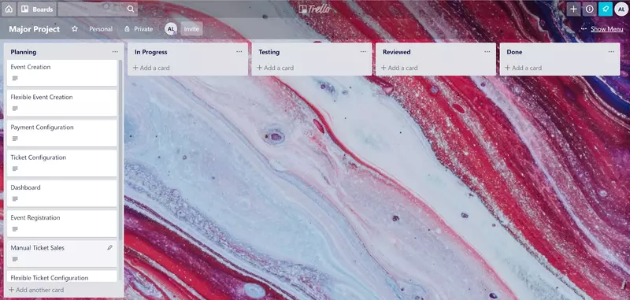

### Web-stack

When I started this project I had never attempted this sort of web app and it was all quite new to me. I started by collecting information about how a web app is made I discovered that they were not made from a single component like a C# program but rather multiple parts. A web app is not a single isolated technology but rather multiple combined technologies. The collection of these is known as a stack. A web stack consists of three primary components these components are the frontend that runs in the browser by the user, the backend that implements most of the logic, and finally a database which stores the information used by the server. A classic example is known as LAMP[^2] which is made from Linux (‘L’, the operating system), Apache (‘A’ a web server), MySQL (‘M’, the database), and PHP (‘P’, the server logic). These technologies mean that the developer can focus entirely on implementing the logic that makes the website do something rather than the boring and useless task of implementing your own insecure and inferior technologies.

  A frontend, backend, and database are the cornerstone components of a web app. I initially wanted to add a place to store the images that users upload to advertise there event. Instead, I simply and efficiently decided to place this into the database as well. My stack ended up consisting of a React frontend, GraphQL backend, and a Mongo database.

### Frontend

The frontend is the pretty part of the application that the user will end up interacting with. I looked into a number of frontend solutions from plain CSS and HTML to my final pick which was React with material design.

#### JavaScript and React [^3]

React is a JavaScript library used to make interactive web apps. In brief, it is a fancy way to quickly update part of the user's web page. React is all about creating modular components. It works by using JavaScript to define a module of a web page. It is hybrid of JavaScript, HTML, and CSS. React is not the only technology to do this, but is the most used. It has a bunch of tools that make working with it easier. My favourite was a tool that auto compiles giving real-time updates. React is beneficial over plain JS and HTML because it promotes modularity and is faster (at times).

#### Material Design[^4]

Material design is the gold standard for modern user interface design. Developed by Google as an open source project for all of their applications the project is a familiar and powerful design language. The principle idea of material design is that the user interface should be made up of layers of components which act like paper. It is a design metaphor where components are layered. You are already familiar with material design as it is the design of almost every Google product. 

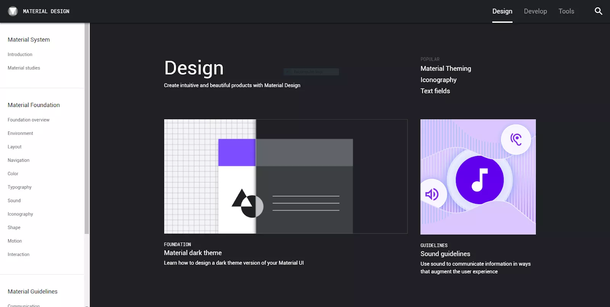

A benefit of using a pre-existing design language is the abundance of tools to create websites that use them. There is an entire library of react components that can be used to create compelling websites quickly.

The final benefit of material design is because it is designed for responsive web development, where it scales for a range of device screens. It lets a developer easily define how the page will lay its self on different screen sizes.

An alternative to material design that I looked at is bootstrap, which is a popular choice for designing websites. It is very widely used and features a clean, flat, and rounded design. It has an aesthetic which is less layered than that of material design making it look flat. I decided against bootstrap because I don't like what it looks like. 

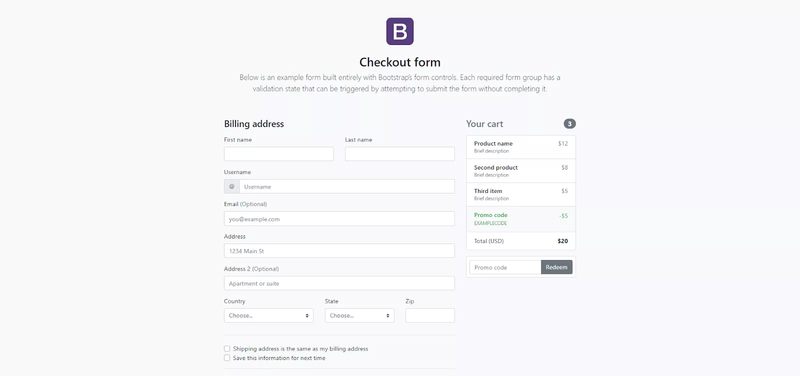

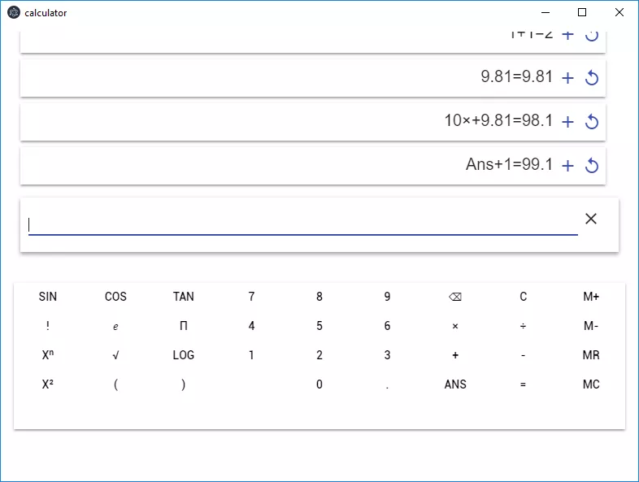

Another reason I chose material design over bootstrap is that I have used material design before. I used it to create a simple calculator app earlier in the year. I found that it made development easy and the end result look aesthetically pleasing.

### Backend

The backend will implement the actual logic of the service. By splitting up the components I make my service more scalable and easily developed. My architecture is inspired by this medium post https://bit.ly/2MdhcDp “How to Build a Simple Web App with React, GraphQL, and Go”[^5] by Chris Chuck. In the article, he uses a GoLang backend to populate and control a react front-end with data stored in a database. Below is a diagram of what my service design looks like.


##### GraphQL

GraphQL is a query language for making a REST (representational state transfer) API (application programming interface). REST APIs let developers use HTTP (the Internet's most used protocol) to define requests to get or set data. For instance there is a rest API which returns information about an IP address. For instance, to get information about my schools external IP “125.236.253.162” you could send the following request to the API.

```
GET http://ip-api.com/json/125.236.253.162
```

In response to our REST API request we get information back .

```
{  
   "as":"AS133420 Spark New Zealand Trading Limited",
   "city":"Hamilton",
   "country":"New Zealand",
   "countryCode":"NZ",
   "isp":"Spark New Zealand Trading Limited",
   "lat":-37.7837,
   "lon":175.2824,
   "org":"Spark New Zealand Trading Limited",
   "query":"125.236.253.162",
   "region":"WKO",
   "regionName":"Waikato",
   "status":"success",
   "timezone":"Pacific/Auckland",
   "zip":"3214"
}
```

By using a REST API my service naturally develops a number of traits. First it becomes modular with the frontend and the backend being independent of each other. Second the client no longer needs to store state as the REST API and database stores all necessary state for it. Three it clearly defines how the service can be used leading to better security and easier maintenance. Fourth, the service is more scalable, portable, and reliable. 
For my REST API I will be using a style of REST API which uses GraphQL which is a set of libraries for implementing REST APIs. The main advantage of GraphQL over some other method of rest API creation is that GraphQL limits what is returned to the client to what is actually requested. A GraphQL library exists for both my backend and frontend so they can communicate effectively. The tools for using GraphQL from the client are also built with caching meaning the services efficiency is increased.

#### Database

A database is a way to store and read data effectively. I decided to go with MongoDB because I had used it before and I did not know how to use table based DB. It simply stores data as JSON, something I am familiar with, and it gives the programmer a way to access it. You can use JSON to construct queries of the database and return only the objects that are needed.

### User Experience

 I started brain storming about the sort of pages I would need. I asked myself, "what sort of interactions need to take place and in what order?". The flowchart shows how the users will navigate the site. I imagined that every user would start on the home page. I had two branches on my site where the event organizers and event goers would separate.  If they were an event organizer they would login. Once logged in, they have a list (Event List) which they can click on to manage, through an editor (Event Editor) or the dashboard (Event Dashboard). The event goers would go to an explore page (discover events) from there they could search for an event, or open an event page. From the event page they would be able to purchase tickets. My final website reflects this initial design with most of the intermediary pages consolidated into the sidebar. e.g it no longer has an event list instead having it in the side bar. 

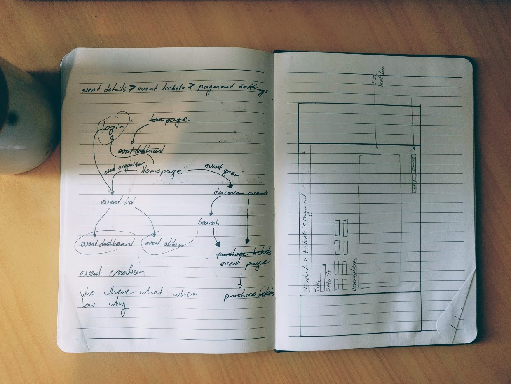 

I then used a program called Figma[^6] to create a mock layout for my website. I recommend Figma, it is like an easier to use Adobe illustrator designed specifically for user interface design. The design I came up with became much more fleshed out compared to my simple paper designs. It was very easy to believe it could without much difficulty become a working website. I did not worry much about practicality when doing the design, and many of the “features” I mocked up did not end up in the final outcome. Despite that it was a useful exercise that made me think about usability and gave me a starting point before I started coding the website. The mock up helped me give the website an overall feel and style. I ended up with 5 main screens down from my paper design's nine.

- Explore events screen
- New/Edit event screen
- View event screen
- Event dashboard screen
- Purchase event screen

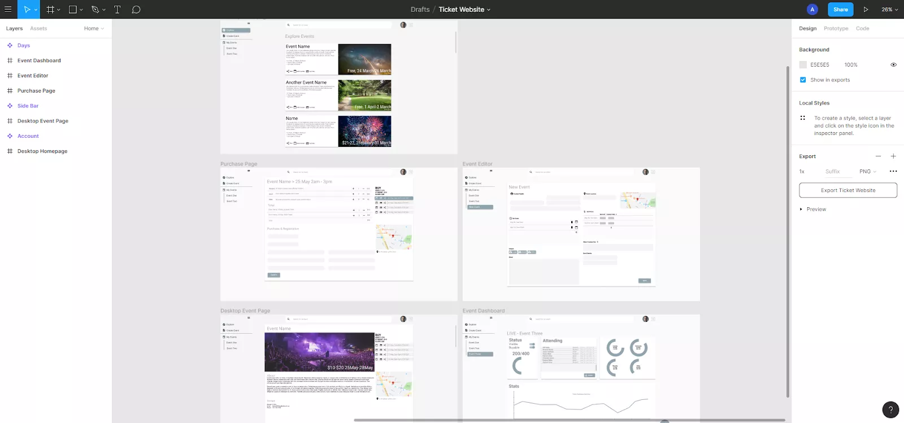

## Developing An Outcome {#Developing An Outcome}

With most of the planning out of the way I started development. I knew that since I had not done this sort of project before a lot would change from my plans. I ran into many, many, many issues most of which will not be mentioned here. Hopefully this gives a good idea of how I went about development and overcame technical issues. Some of the issues I ran into persist because I ran out of time to fix them. Despite that I am very proud of my outcome and think it turned out well.

### Getting Started

> “Cards contain content and actions about a single subject”~https://material.io/components/cards/

I started simply because I was not familiar with react. The first component I created was the “event card”. This was a card which displays all of the information about an event in a compact form. At the time I used mock data because I had not created the backend yet. The main difference in React development was its concept of “state” (persistent variables). Whenever the state changed the component would re-render. Another interesting difference is that react components communicate with each other through their “state” and learning how to activate one component from another took some getting used to. However, once you get the hang of it, it's kind of fun because it lets you combine HTML with JavaScript in a really powerful way.

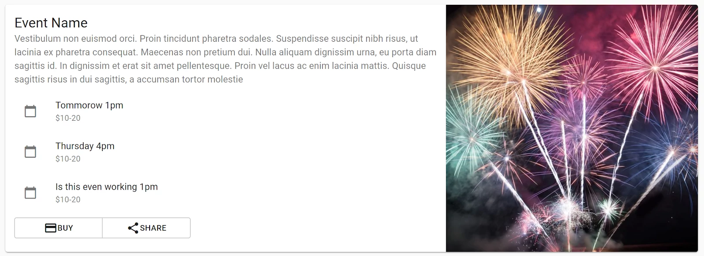

### A Name

Every website needs a name and a logo. Despite it being not entirely necessary I felt like it was an important part of making the website *real* and trustworthy, something to make it all come together. I used the Greek word for theatre, “theasthai”, meaning behold. I thought it was a good fit because it gave the website a fancy elegance. I used Figma to create two logos. A small one for use as the websites 'favicon', which is the logo in the tabs of a browser. And a large title to be in the centre.

<center></center>
Branding is important because it gives people a sense of what sort of character a website has. Google’s logo conveys playfulness. Apple’s logo conveys elegance, cleanliness, and quality. My logo uses a serif font which we associate with older companies. I think it gives my website an austere and trustable quality to it. 

### Building From Scratch

Starting from scratch is hard. Why would you? Instead, I copied and got a very simple project running very quickly. Think of it as a skeleton. As previously discussed I based my initial skeleton off of Chris Chuck’s article and code “How to Build a Simple Web App with React, GraphQL, and Go”. Chris’s app was basically like one big example to help me get started. His app was a fun, *not todo app* where you could add things to a list of things not-todo. This is a good example because it shows off adding and viewing data. In my most recent version of the app, only a few lines (maybe none) remain of this initial skeleton. That being said it catapulted me ahead in my development. It meant I did not need to worry about reading all of the docs and spending hours creating a simple example myself, I could start expanding and modifying straight away. Below is the primitive app.

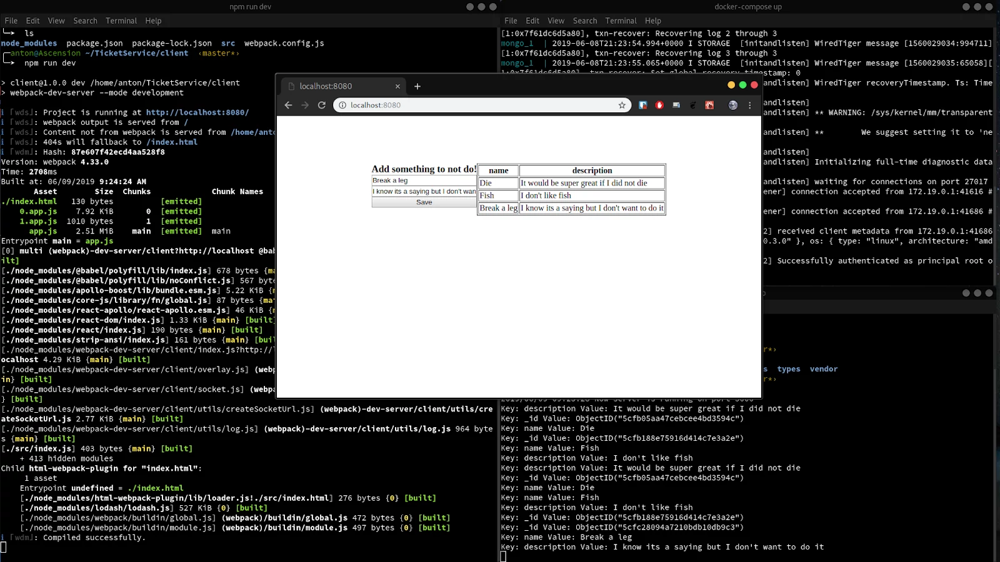

### Logging in

One of the most fundamental obstacles I had to overcome was how to manage users. The website needed to prove that a user was who they said they were. The frontend can not be trusted because it can easily be tampered with since it is run in the browser. Instead of storing passwords and emails, I used Google authentication instead. This is the button that says “login with Google”. When the user clicks the button the user's browser is redirected to a login page that Google operates. When the user has finished logging in Google redirects the user back to the site with some authentication information in the URL as a parameter. Users can simply use their own Google account rather than having to create a new one. It also lets me use the users Google profile picture and get some basic information about them.


Using Google is only part of authentication and authorisation. The application also needs to remember a user and the fact they are authorised. Imagine how annoying it would be if a website would log you out every time you refreshed or left and came back. What’s more, the backed also needs to remember whom it was talking to, so that the application can verify the identity on every request.

I initially tried a method involving JSON Web Tokens (JWT). A JSON web token is just a specific format for JSON data which is then signed and hashed using an HMAC. Simply put you could think of it as a stamped and sealed envelope that contains information. When the user is first authenticated by Google the backend would generate one of these envelopes with a stamp and seal. It is then sent to the client. Each time the client needed something from the backend it would send the envelope (JWT) to the server. The server could trust that the information in the envelope was not tampered with. If I had continued down this route I would have been sending a long token every time the client used the backend. JWT's were interesting to learn about but were not a good solution.

In the end I decided to use a session token. This is a random number which is generated when the user logs in. It authenticates a session telling the backend who the user is and that they are authenticated. You can think of my session token as a throw away password and a username. Each time the backeds graphql API is called the session token is sent. The session token is a nice easy and secure way to make sure a user stays logged in. My solution is based off of a bunch of research into how other sites do this sort of thing and I am quite happy with how it turned out in the end. If you look at the cookies on any site it will normally include one type of session token, session id, or just SID. 

In my research, I discovered that for my website to be secure I had to handle my session ids in a specific way. My application could be vulnerable to a brute-force attack where every session-id is tried to gain access. To avoid this I followed the advice of the Open Web Application Security Project which recommended a session key of at least 128 bits[^7]. To be safe I used double that length and went with a 256-bit session id. I also made sure to use GoLang built-in cryptographic random number generator. One final consideration is that the session id should expire. The reason for this is that a computer should not stay logged in forever because an attacker could steal the session id and use it forever. Below you can see my session token stored as a cookie on my website. (The csrf_token is used by the Google authenticator to add additional security)


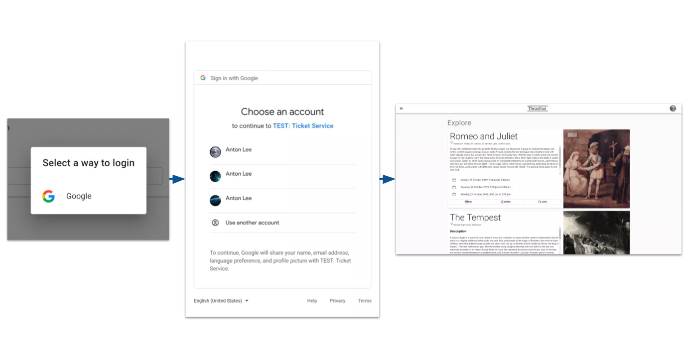


### Event Editor

The event editor is the core of my application. It is a place where users can create and edit events. I needed a way for my application to ask a user to define an event in such a way they did not need to know any programming. I had originally envisioned it would look something like this:

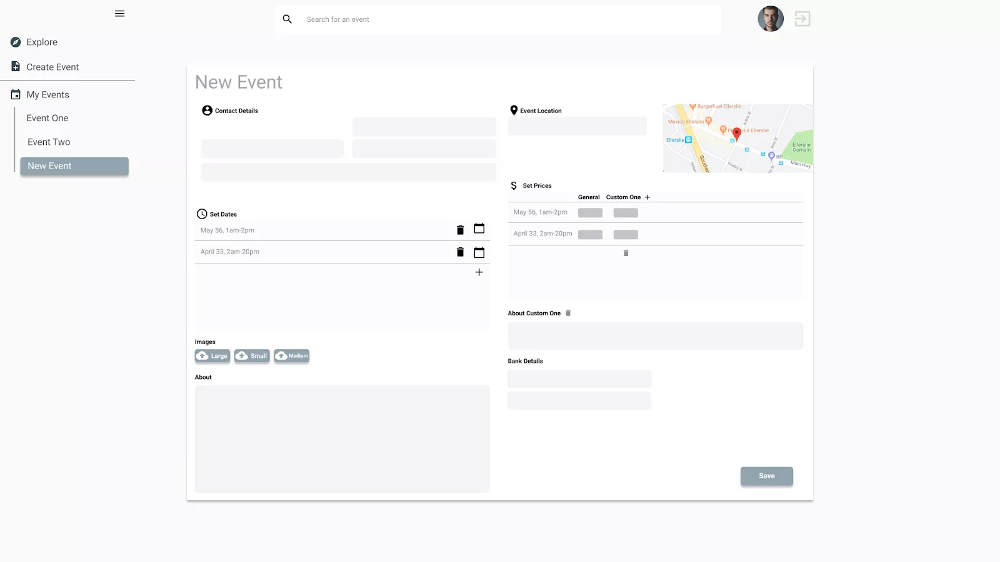

Where everything would be done on a single form. All someone had to do was fill it in and it would be completed. When I started the implementation I was inspired by steppers (shown below) where the process is split into an ordered set of forms. I decided to go with this approach because it left me with more space to play with. I think it leads to a design which was more focused and easier to use. Now a user would click next until they complete the process.


Before the event editor, the only way to create an event was through the GraphQL API or by adding a JSON object. It would have been possible to add an event but only through the clunky interaction of a text editor. The event editor allowed me to interface between the computers understanding and the human understanding of an event. It is kind of reminiscent of how computers first developed graphical user interfaces. It's possible to do everything on my website or a computer through the command line and text but it's not easy. The GUI allows anyone to start using technology easily and powerfully.

#### Event Description

Ms Binks wanted to be able to show off, describe, and advertise her event. I went about achieving this specification through the event description. It is a summary of an event, that the site would use to advertise the event. I ended up using a project called React Quill[^8] which is a rich text box that lets the user enter styled text. React Quill outputs the styled text as HTML which could then be embedded throughout the site. For instance, the event card and the event viewer all have this HTML rendered in them. Something else I wanted was an image that the site could display alongside the description.

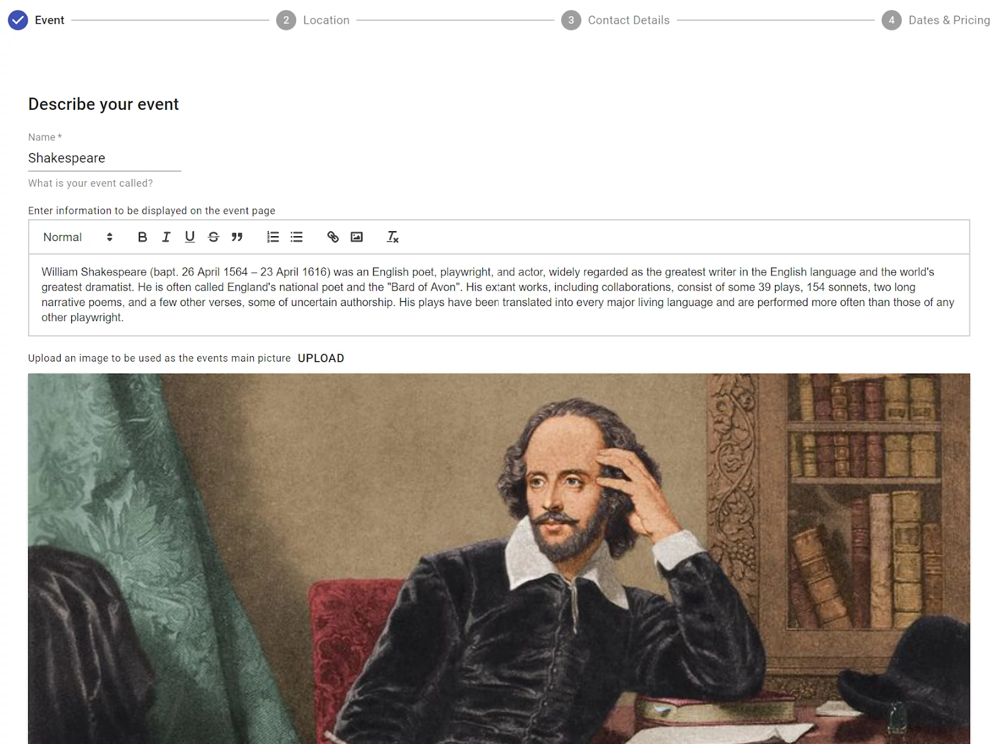

The images used in the description needed to be placed somewhere once the event was saved. I had initially intended to upload them to some sort of object store or save them directly to disk. In the end, I decided to simply place images into the database. It was a simple and an easy solution which saved me time at a cost. Placing images into a database has drawbacks. The major one was every time the event document was loaded by the backed from the database it came with a few kilobytes of image. This would lead to decreased performance. Given more time, switching to a proper image store would significantly increase performance. Another drawback is that the mongodb documents are limited in terms of size to a few megabytes. If an image was two large it would lead to an error saving the event. At the end of the day, I found it was easier to implement storing the image in the database despite performance and functionality limitations.

Many times during this project I would be faced with a choice between time and quality. Implementing something in a better way often costs time. Sometimes I found it difficult to pick which things were worthwhile. My biggest obstacle in this whole project was time and that led to some corners being cut. Whether or not those decisions were wise is something that the only retrospect will decide. In this case, I stand by this decision as it let me focus on actual functionality and it never really became an issue of significance.

Placing images into a text-based database is a little strange. I had to encode the image into base 64 by using data URLs[^9]. A data URL is a URL which works exactly like a URL except instead of referencing a site online it simply contains the data itself. Below is a simple example. This is ideal because in future I can change the data URL to a normal URL if I decide to improve performance.


#### Event Location

It was required by my stakeholders that they could define the location of an event. I wanted to let a user pick a location on a map and also enter a text description of that location. Ms Binks was especially excited about this feature because it would let her visually show exactly which building the event would be in. Initially, I wanted to use google maps to get the map but Google charged for this service. With a bit more searching I found open street maps that did not charge for their service. Using open street maps I created the map using an excellent project called pigeon maps[^10]. Pigeon maps made adding the map easy. One drawback was the library did not include a draggable map marker so I had to use and modify a plugin to allow me to have the map marker. In retrospect, it may have been easier to pay for the Google Maps API.

<center>


</center>

If I was using the Google Maps API I would have access to a technology called geocoding where a location is associated with an address. For instance, you could write Molesworth St, Pipitea, Wellington 6011 into the address field and get the GPS coordinates. Instead of using geocoding my address field can contain anything. In this way we allow users to describe as well as put in the address. For instance 141 Masters Ave, Silverdale, Hamilton. At the Hillcrest High School auditorium in C block is a valid address. The flexibility of a simple text field I believe will lead to users describing the location in a more meaningful way. This coupled with actual GPS coordinates on a map should leave no reason for an event goer getting lost...

#### Date and Pricing

The date and pricing UI is used by the event organiser to define tickets. It turned out to be my favourite bit of the whole website because it is easy to use and almost fun. It lets someone easily define and create as many events as they like. 


One of my favourite details is that the app doesn’t let the user delete every event and ticket requiring them to have a bare minimum. This rose a philosophical question, is it better to prevent an error or to merely report a mistake? I found the answer to be both yes and no. One case where it was annoying was with the date-time pickers. I had two pickers for the start and the end time. Initially, I thought it was a good idea to prevent someone from selecting a start time that was after the end time. Makes sense right? You should not be able to start an event after it has ended. However, this limitation led to my testers being very confused. The location of the start picker is the top left which means people see it first and click on it first and attempt to set the start time but cannot do so since it would mean having the event start after it ends. In this case, forcing people to enter an always have a valid input makes it harder to use. To resolve this I removed this constraint so that the user can organically enter the dates. If they left the start after the end it would highlight the mistake and stop them from progressing. In the case of the delete buttons not letting someone set an invalid state is advantageous. In the case of the dates, it is natural for it to be set to an invalid state briefly. This sort of bug popped up in several places. Places where I aggressively verified the input became confusing. For instance, I have it round the prices to two up and would not allow an invalid input. This, however, leads to confusion when someone tries to backspace the original 0 but can not do so. This makes them confused since it is not a consistent and familiar response. The website is still usable but it leads to weird interactions that people can get stuck on. 

### Event Dashboard

The event dashboard is where an event can be managed. The event organiser can delete, edit, activate, manage, or view receipts for an event. The event editor ended up looking quite similar to my plan (on the left).


 I was inspired by other dashboards (like the Kubernetes one below). These dashboards use floating cards containing pieces of information. I liked the cleanness it gave, with each “card” focusing on a specific idea. I so far have 4 cards containing the events status, total tickets sold, event tools, and a table of ticket purchases. For the big pie chart, I used a library called recharts[^11]. I hope to be able to add line charts and more pie charts in the future.  The most important thing on this page is the big status switch which determines if the event is “active”. When an event is active it is viewable and purchasable. While it is not active the event is only viewable by its owner.

A critical feature I added is the ability to download a CSV (comma-separated values). The file contained everyone who has purchased an event. Letting users download and view who is attending an event. The event organiser can also view the data in a spreadsheet. Ms Binks was dazzled when I showed her because it was a feature she had not asked for but immediately recognised the value of. If Ms Binks wanted to send a bulk email informing them of an event cancellation or extra details she would use this CSV file.


### Event Explorer

The event explorer shows all events that are currently active. I envision most people would be given a direct link to an event page but I also wanted to offer a home page where people could take a look at the current events that they could attend. I initially wanted to have search functionality and limit the number of events on the home page, but because of time constraints that did not end up happening. Something I quite like about the page is that it loads events in parallel. This means that the cards will load as quickly as possible and are not dependant on each other loading.


Since early on I knew I needed a procedural way to advertise tickets. My users would not know how to program so I needed a way to populate a component with their provided information in a pretty way. I decided on this “card” system where each event has its own contained and repeated UI. One improvement I made over my initial design was the implementation date buttons. They easily add events directly to the cart. I ended up with three places where tickets can be purchased. The buy button, the date buttons, and the date buttons in the event viewer. I did this because buying a ticket is the most important part of the website, so it was important that you can buy something on the home page.

### Storing an Event

Mongodb was great to work with. Mongo uses JSON and a simple query language which meant I did not have to learn SQL. Mongodb Compass is a program that let me look inside the database and make changes. This was great for debugging. Below is what an event object looks like. It contains all of the information about an event.

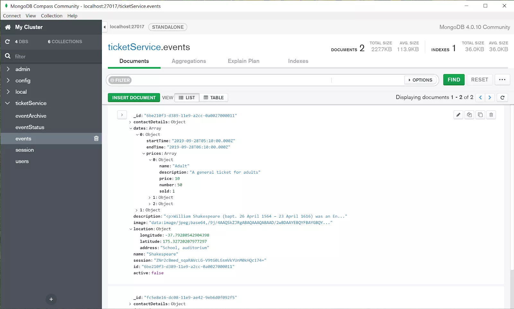

MongoDB places data together at 3 levels. The first level is the database level where each mongo instance has multiple databases for multiple apps. The next level down is a collection. A collection is a group of documents. A document contains the actual data. For instance, my backend connects to the `ticketService` database and then looks in the `events` collection to find the above document that defines my event.

### The Sidebar and Routing

A typical website would have a separate HTML file for each page of the website, home.html, blog.html, etc. Each time the browser went to a new page it would download the new HTML and then display it. React works differently, instead, it is a single page that changes it’s HTML (specifically the document object model rather than HTML) and downloads more of the website as needed. This can lead to more responsive and complex websites and applications. The multipage appearance of my website is achieved through routes and routers. These components look at the URL and decide if they should render or not. This helps with modularity. In a traditional website, the app bar would be duplicated on each HTML document and be re-rendered on every new page. This makes things slower and makes HTML harder to maintain. I leveraged routes to display my app bar and sidebar on every page. I placed the routes inside of a container in the centre of my page (pictured below). When you change pages on my site the contents of that container is simply swapped out rather than a new page being fetched.

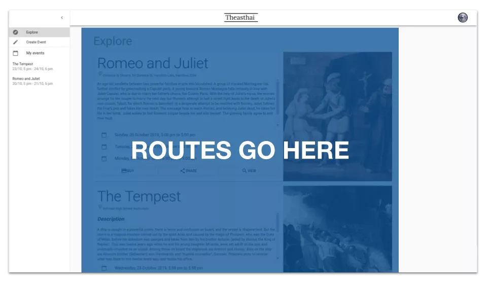

The URL determines which of the routes should be displayed. Many of my URLs as a result include the event ID in them. This lets them easily reference and fetch it. This was essential for my website as it allows a URL to be shared that will take a user to a specific event.

`http://localhost:8080/event/6be210f3-d389-11e9-a2cc-0a0027000011`

 Having dynamic URLs like the one above and routing are only part of creating a way to easily navigate. Something to note is that these URLs only work for users that have permission to view a specific event. I also created a sidebar which changes depending on if you are logged in and displays some basic information about a site. Once logged in a whole bunch more options appear for managing the events.


### Backend

In the design phase, I decided to go with GraphQL for the backend running on a Golang server. I used https://github.com/graphql-go/graphql as my implementation of the library. GraphQL is like a REST API with a little more structure to it. Using GraphQL was good because it meant my coded ended up with a clean(ish) structure. GraphQL splits every request into two categories of queries and mutations. Queries are used when information is requested. As an example `myEvents` was a query that took a session id and returned information about that user's events. GraphQL is better than a rest API because it only returns the requested information. The requests do not have superfluous information sent. Mutations, on the other hand, are intended to modify and change data.

During development, I used a tool called GraphiQL which let me send GraphQL requests. The tool let me quickly test that my backend was working correctly without having to code anything. Below is an example mutation where an event is created. The lower third contains the data which is sent. This third is what is generated from the event editor. When developing the backend this tool was used nearly constantly. It shows the benefit of splitting the frontend and the backend because I could develop the backed without caring too much about the frontend. The divide it created was very useful.

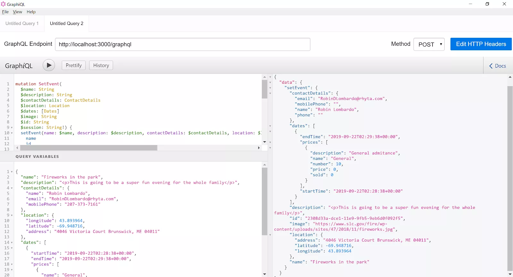

The backend’s code’s responsibility was to define all of the rules around these queries. The most basic rule is a session id is needed to do anything. Almost every request required a session id so the user could be authorised.

### Cart

The purchase page was initially meant to be a separate page (shown below). Despite this, I decided it might be cool to have a popup cart which follows the user around the website. The cart has a 'hide' button that will drop it out of the way so the user can see the website. This was interesting to implement since the exact height of anything is not known because the website reshapes itself based on the screen size. To work my way around this I used react hooks to access the element at runtime. This let me do some quick maths to adjust the height offset of the cart so that the cart is off screen. I even added a smooth animation for the transition making it very satisfying to use. One issue that did arise is that the floating cart bar would sometimes obscure text. To rectify this I added appropriate padding to the bottom of the page so that scrolling will always show all text. Another issue was that when you add events while it is hidden the offset is no longer sufficient and the cart sort of climbs up the page.

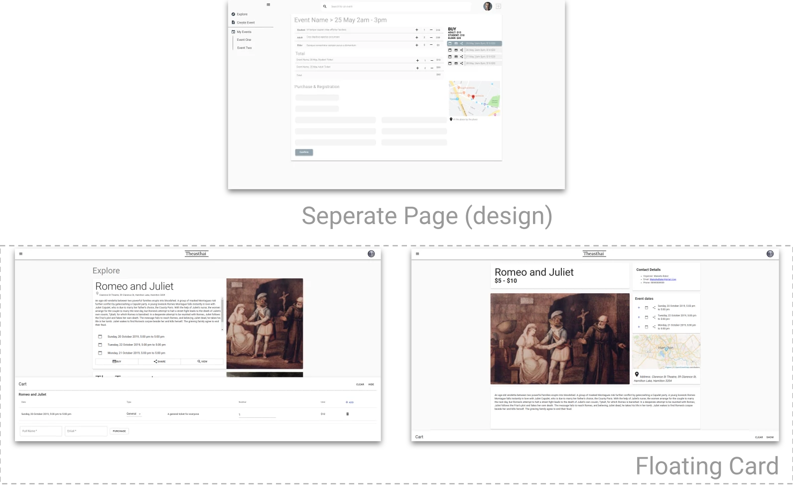

### Tickets

The website does not store every ticket instead it only stores the receipts of ticket purchases. Ms Binks still wanted physical tickets. They would act as a memento that they could present at the door to gain entry. Unlike professional tickets that use barcodes to verify validity. They would rely mostly on honour. My tickets are simple. The principal information they contained was the name of the ticket holder, the type of ticket, and the event. This was my mockup design using Figma:


I gave myself the requirement that it should be monochromatic so that when printed in black and white it would still look nice. Colour tickets with images very rarely look nice on a home printer. This was an issue I had noticed with my tickets in the past. Although not a secure ticket it does allow event organisers to have an easy way to know who has made payment and who has not. 

#### Email

After purchase, an email is sent containing the tickets.  This way, the user will not misplace their ticket pdf. This is standard practice to confirm a purchase. 

Email is fascinating it uses a technology called SMTP or simple mail transfer protocol. It has some similarities with HTTP. I used the built-in library to send emails from my backend https://golang.org/pkg/net/smtp/. SMTP is a distributed system using SMTP servers to send mail around the world. I could create my SMTP server and use it to send mail from a custom domain or use a preexisting one. I decided for the time being to simply use my Gmail account’s SMTP server managed by Google. I decided to send HTML formatted emails. These are those fancy emails that you get from corporations that look like magazines. Sadly email HTML is a limited version of HTML for security. It primarily uses HTML tables rather than divs to format and create a layout. It was kind of like learning a whole new HTML. Luckily I found some email templates that allowed me to cut out some of the work.

Golang has a very powerful template library. Below is an example of it in action. It lets you define where text should appear. This allows for the effective creation of personalised emails.

<center>


</center>


I wanted the user to receive tickets as a PDF attachment so that they could easily print and view but not edit them. Since I had already learnt how to template with HTML I decided to convert from HTML to PDF instead of learning new techniques. I used a program called [wkhtmltopdf](https://wkhtmltopdf.org/) to do this conversion. Using the same template as used for the emails I created a web-page that I could convert to a PDF. I then attached the PDF to the email. Bellow is what a final ticket looks like.

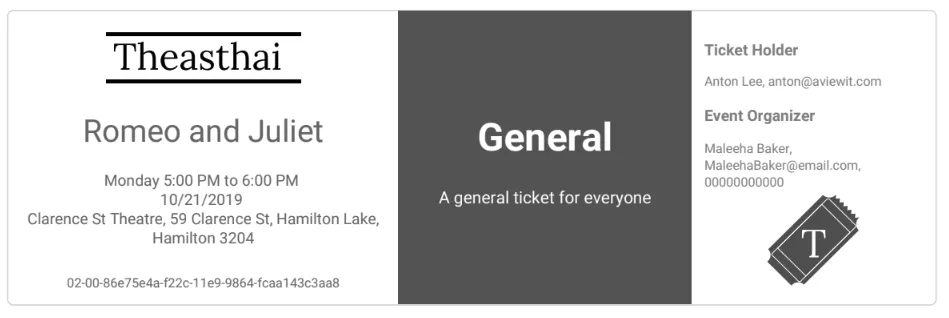

### Payment

I left setting up how my website would manage payment late in the process since I had some anxieties about how it would work. Most websites conduct billing through what is called a payment gateway. A payment gateway offers a bunch of different APIs and tools for merchants. These gateways can offer these tools because they have shown themselves to be secure and made deals with the bank or card company. I had intended the site to be a platform where anyone could log in and create an event. That would have needed a payment gateway which allows for peer to peer sale. That same gateway would also have had to talk to my server. This sort of thing did not exist in the form I wanted. So, for the time being, I decided to set up the server to work with a single payee. This left the question of which payment gateway to use. 

The payment gateway needed to be cheap and easy to attach to the service. I decided on POLi pay. POLi pay uses your online banking rather than a credit or debit card. POLi pay is good because it only takes 1% of the payment and is capped to only taking $3. Other options also exist and in the future, it would be beneficial to offer multiple payment methods.

POLi pay and most payment gateways expose a rest API to developers that allows them to use the service. See the diagram below. Please note the similarity to the way Google’s Authentication API works. The top-left screenshot shows postman, a commonly used development tool to send HTTP requests without coding.

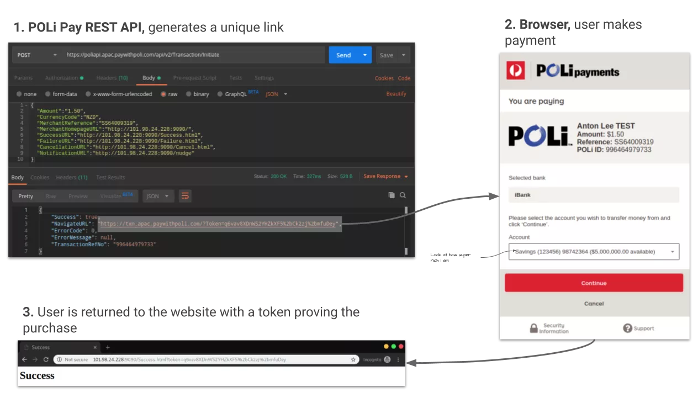

Purchasing a ticket takes time. What would happen if another user bought the last ticket while the first user is still trying to buy the very same ticket? Should a refund be issued and an explanatory email sent? This would be a very clumsy solution. Instead, **before** the user starts the POLi pay process the tickets are reserved so the second user can not buy them.  Unfortunately, another problem occurs, if the first user cancels he still has the tickets reserved, so the second user can't buy them. Luckily POLi pay offers a very convenient solution called a **nudge.** The nudge is an HTTP request made to my server containing a token. The nudge is guaranteed to be made no matter what the user does on POLi pay. This way the tickets reservations can be cancelled on a terminated purchase or they can be confirmed on a successful one. 

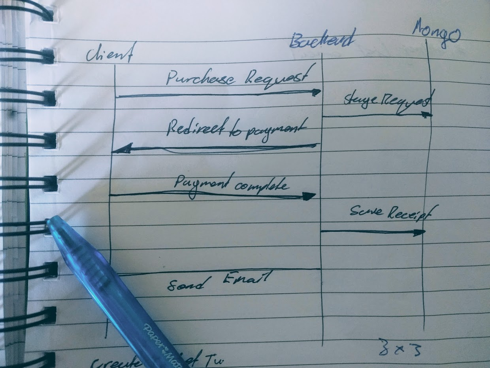

### Deployment and Configuration

Docker is a technology that make deployment more reliable and portable. You can think of a **docker** as a computer running inside of another computer. Dockers mean that the program can run on any (of the same architecture) computer. Dockers are created by a set of instructions that install all of the required software in them. Dockers are also the easiest way to get something hosted. “Hosted” simply means the software is placed on some computer in the cloud. By packaging my website as a set of dockers they can easily be run safely in any environment.

Cocker-compose is another tool which lets you define how the dockers talk to each other. Before implementing the docker-compose all of my variables were hardcoded into the program this is wicked because the program requires recompilation to update them. I switched to using environment variables that are tweakable in docker-compose. The most important variables tell the program secrets that allow it to access POLi and Google API. I can use the docker-compose file to easily start and restart the service as well. On the right, you can see the containerized app running. 

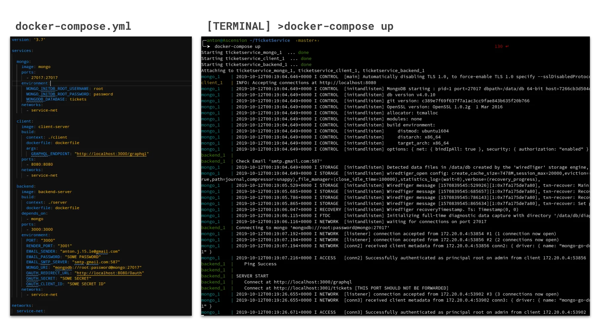

## Testing {#Testing}

Throughout development, I have been constantly testing. I would make a change then check that it worked. This is good but not ideal. The website handles payments so it is vital that it is reliable. If the website were to error it could result in users losing money or the whole site coming down and data being lost, in the worst case. Another aspect that makes testing difficulty is the complexity and range of edge cases and rules. Every parameter of every form would need a range of tests conducted. Does it work with a number, whitespace, brackets, 0, infinity, -1, strings, etc. The errors would then need to be caught and reported before they snowball into larger issues. Furthermore security is also a consideration: free tickets?,  replace events?, data leaks?, etc. Finally, as a website it should handle multiple users doing stuff all at the same time? It requires good testing while also being surprisingly complex to test.

 Ideally, I would have been writing unit-tests or automated tests as I developed. An automated test is a piece of code which checks another piece of code works as expected. For instance, a series of GraphQL requests could be made to check that events can be created. To properly test my code I would require at least a hundred automated tests testing the backend and frontend. The tests would need to be able to recreate multiple users using the website all at once. Unit tests would help convince the client and that my software is reliable and free from critical bugs. However, due to time restraints, I could not do the desired quality of unit tests. Instead of automated tests, I would rely on my ad hoc testing and usability testing for the prototype. When the website is publicly accessible it will first require more stringent and reliable testing.

#### Testers

I was the primary tester. I would continuously test and make sure things work. Not just at a functional level but a user experience level. Sometimes when I added stuff it would simply look wrong or not ‘feel’ right and would need to be changed. One addition I made was the duplicate button for events. This was something I added when I got tired of re-entering information. Being the developer did leave me with some blind spots. I knew exactly what I had to do to complete a task, meaning it was difficult to look at something with a fresh perspective.


Fellow programming students were convenient testers. They worked as a way to show off what I had done and also to get that fresh perspective to understand it's usability. Programming students were useful because they understood the sort of edge cases that might let them break a program. For instance, David found that if you hit the new event button a few times you could create a bunch of cloned events. This sort of thinking shows how having someone that understands where bugs come from can be useful.

The final class of testers were friends, family, and teachers with no programming experience. Getting the feedback of people who are worse with technology was important, to make the program accessible to more people. These people gave a different sort of feedback of less tech-savvy people. Ms Binks mentioned that she was concerned whether the website would be easy for elderly people to use.

#### Bugs

##### Lost in the Firewall

I encountered an issue when I first tried to integrate POLi pay and its nudge system. From my perspective, I would complete a transaction and end up waiting for the nudge indefinitely. I expected the POLi server to make a request to my server but it did not. Was POLi pay not sending the nudge? Was it sending it to the wrong place? Was the server not listening? Or was it not going through to the server at all? 

It turned out the issue was that my firewall was not allowing the request to come through. A firewall is a filter that stops your computer talking to the outside world in specific ways. It's good for security because it means your computer is never secretly doing anything and only certain apps are set up to be able to talk to the outside world. However, it meant that the nudge from POLi never reached my computer. When I exposed the ports of my server to the outside world my server still did not receive the nudge. The issue I discovered was that my network router was not configured to route traffic to my PC. So when the POLi server sent the request to my external IP it was not redirected to my PC on the network. To resolve this I had to re-configure my router to send the request to my PC. By configuring the router and my PC to accept requests I successfully intercepted the nudges.

##### Data Verification

Early versions of event editor lacked any sort of verification. Empty fields could be used to create an invalid event. To fix the issue I made every field expected a certain type of input in the event editor. I used regular expressions to make the fields expect a certain format. The event editor would block the user from going further until the issue was resolved.


##### Reporting Errors and Success

Initially, if anything ever went wrong the user would have no idea. The only way to check for errors would be to open the developer console. If anything went wrong, the user would be faced with a loading bar and the false sense that everything was working. Or if the user completed something they could be unsure whether it worked. To resolve this I decided to use something called a snack bar. A snack bar is an alert that pops up to give reassurance or notify the user of an error. Snack bars allow users to retry or have confidence that something worked. Below is an example where the user is reassured of the successful purchase. In other cases, it may display an error message. As a developer, this addition was very useful as it visually told me if an error occurred without having to check the logs.


##### Cache

An issue I had ignored is the fact that when an event is created the sidebar does not update to include it. This issue was caused by caching results. The frontend uses a JavaScript library called Apollo to talk to the GraphQL backend. When a component updates, Apollo does not always make a request to the backend, instead it sometimes gets the information from the cache. As a result, a mutation does not always update the rest of the UI. If an event is changed from inactive to active in the dashboard it did not update the rest of the UI. The user would have to reload the page to see the changes. A user would be led to believe that the operation had failed and that they should retry when in fact the UI was simply not updated.

Apollo offers a way around this where the cache is updated when a mutation is made. When the backend’s state is changed the frontend’s state is updated. This way, the frontend and backend stay in step with each other and accurately represent the state of the system. This provides a solution where requests do not need to be repeated because the mutation knows how to update the cache without making a request to the API. 

##### Cart

My tester found the cart overlay to be very annoying. In the below screenshot you can see why. When lots of tickets are to be purchased it can end up taking up a large portion of the screen. My tester thought it might be more convenient to have it be denser or be on another page. This is more similar to my initial mock-up using Figma. 

Another bug my tester found is whenever the ticket number was set to zero the ticket would disappear from the cart. It meant that when a user “backspaced” the specified ticket number to enter a new number the ticket would disappear and would have to be re-added. The reason for this bug is the way the cart uses its data structure. When a ticket is added it’s event is added to an array. The specific ticket that the user wants to purchase has a special field added that represents the desired number of tickets. If that field is zero or undefined the ticket is not displayed. It follows that when the user changes the number to zero or to empty it hides the ticket. To resolve this bug I would require a way to specify that the ticket is currently zero or undefined but will be defined. 

### Conclusion {#Conclusion}

**VIDEO DEMO**

<div style="padding: 10px">
<video style="width: 100%" src="vid/demo.mp4" controls autoplay/>
</div>

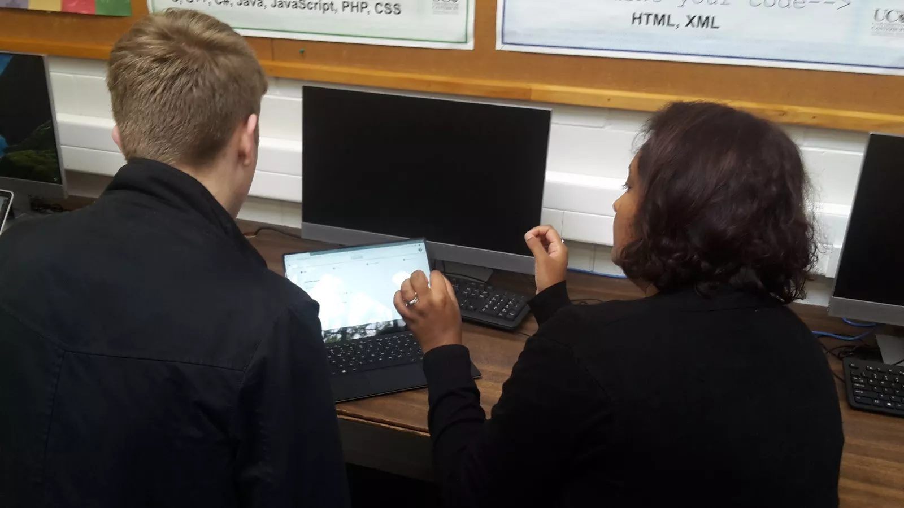

I walked Ms Binks through the current state of the website. She was thoroughly impressed with its professionalism, design, and scope. My main takeaway was her excitement at being able to use the service. However, I had to explain that the website still needed a bit of work to be ready. I still had to finish some final features, testing and debugging. We discussed briefly where it could be hosted and Ms Binks proposed it could be hosted on the hillcrest high servers. I was pleased to see Ms Binks thrilled about the progress I had made on the website.

#### Fitness for Purpose

To conclude the development of the prototype I went through all my user stories and ticked them off if I had met the requirement. Below are the requirements I have failed to meet because of time restraints. Most of them are extra features that my clients would have liked, but are not required for the service. The more serious ones are those regarding properly testing the service and making sure it is robust enough to be safe to use. The website is a good prototype but is not reliable enough to be used by a client.

- As an event organizer, I want to be able to sell tickets in person but still be able to log the purchases in the service so that I can offer door sales while still keeping track of numbers
- As an event organizer, I want to be able to blacklist and whitelist people for events so that I can restrict who can attend events
- As an event organizer, I want to be able to create private events that can only be accessed with a certain link
- As an event organizer, I want to be able to offer a pay what you want system so that event goers can donate to the event organization

*I never got round to implementing these features because I ran out of time*


* As an event organizer, I want to be able to access the service through a mobile device so that I can manage  ticket sales from my phone.
  *The website is accessible on a mobile device and works, but it will take more work to make it nicer to use. Above is a screenshot showing what the website looks like on a mobile device. It is usable but not particularly elegant.*

- As a developer, I want to have a good test suite so that I can see if any changes break code

-  As an event organizer, I want to be able to trust that the service will never incorrectly sell tickets so that we do not break laws or upset people.

   *As previously discussed the next steps for the website is the creation of a comprehensive test suite and the squashing of the remaining bugs.*

The outcome is a still a little way from being “done” (and like anything good will probably never be completely done). Below are the steps that I will need to complete to turn my prototype into a final product. 

1. *Implement final user stories*
2. *Fix all known bugs/issues*
3. *Write a series of unit tests for the backend*
4. *Get POLi pay integration past POLi pay QA so that it can use real money*
5. *Get it hosted. Domain name and server*

#### Reflection

Overall I am very happy with how this project turned out. It was of a larger scope than I had originally naively thought. My main goal of doing such an ambitious project was to learn a range of skills and create a useful project. It was my first time making a website of this type and it was a very educational experience. I’m a little disappointed with the quality of my code in some places, but that was to be expected because of my newness to the technologies and techniques.

I learnt about:

- REST APIs with GraphQL
- Using templates in Golang
- React apps
- Material UI
- MongoDB
- authentication/authorization
- OAuth and POLi pay

If I were to do it again I would have planned more. I should have spent longer understanding React and MongoDB rather than jumping straight in. This would have led to higher quality and easier to work with code. I learnt the valuable lesson that refactoring is a billion times more time consuming than doing it right the first time. Planning would have meant I avoided many bugs and been able to make changes easier. Another mistake I made was not keeping up with my Gannt chart. I ended up spending more time doing development and it made me fall far behind where I was supposed to be. I ended up running out of time which led to the site lacking the required rigour of testing and quality control.

The aspect I think that turned out the best was the user interface. Using Material UI led to a clean and beautiful user interface. Figma was the best design software I have ever used and saved me time. This design led to a stronger user interface that is more usable by a larger audience. Another aspect that worked well was the idea of having a distinct backend and frontend. I think the project achieved great flexibility and is able to work for a broad range of event types. I like to think, almost any event could be advertised and organized through it. 

The website I created is not fully complete, however, it is functional. In the future I will have to test and deploy it to make it a real usable product for my client. I learnt a lot doing this project and Ms Binks is happy with the progress made.


[^1]: Queen + Adam Lambert - The Rhapsody Tour (May 14 2019) https://www.ticketmaster.co.nz/queen-adam-lambert-the-rhapsody-tour-auckland-07-02-2020/event/24005686DE4D220B
[^2]: What is a full stack? https://www.w3schools.com/whatis/whatis_fullstack.asp
[^3]: Why use react, https://stories.jotform.com/7-reasons-why-you-should-use-react-ad420c634247
[^4]: Material Design, https://material.io/design/
[^5]: How to Build a Simple Web App with React, GraphQL, and Go,  https://medium.com/@chrischuck35/how-to-build-a-simple-web-app-in-react-graphql-go-e71c79beb1d
[^6]: Figma, https://www.figma.com
[^7]:  Insufficient Session-ID Length, https://www.owasp.org/index.php/Insufficient_Session-ID_Length
[^8]:  React Quill https://github.com/zenoamaro/react-quill
[^9]: Data URLs https://developer.mozilla.org/en-US/docs/Web/HTTP/Basics_of_HTTP/Data_URIs
[^10]:  Pigeon Maps https://github.com/mariusandra/pigeon-maps
[^11]: Recharts http://recharts.org/en-US/

<script>
  var images = document.getElementsByTagName("img")
for (let i = 0; i < images.length; i++) {
  const image = images[i];
  var newImage = image.cloneNode(true)
  var div = document.createElement("div")
  var figure = document.createElement("figure")
  var caption = document.createElement("figcaption")
  caption.innerHTML = newImage.alt
  if (newImage.getAttribute("align")) {
    newImage.removeAttribute("align")
  }
  newImage.addEventListener("click",function(e){
    window.open(e.target.src)
  })
  figure.appendChild(newImage)
  figure.appendChild(caption)
  div.appendChild(figure)
  image.replaceWith(div)
}
</script>